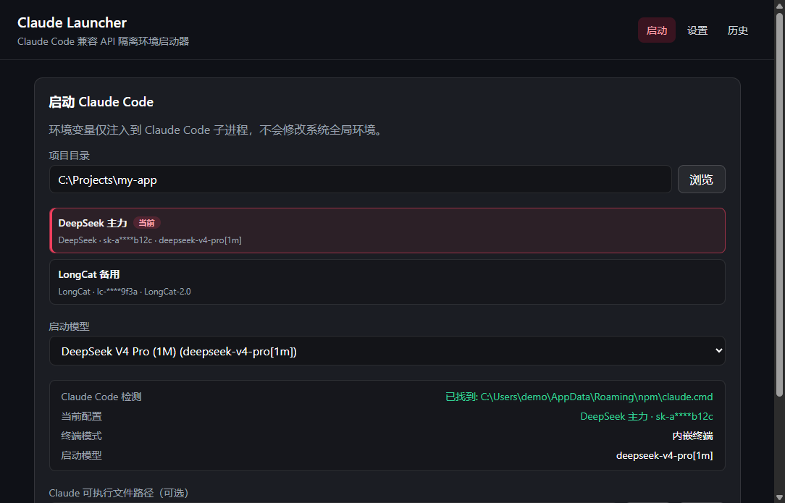
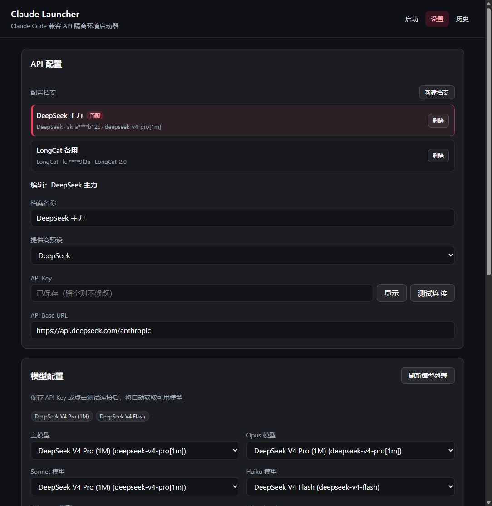
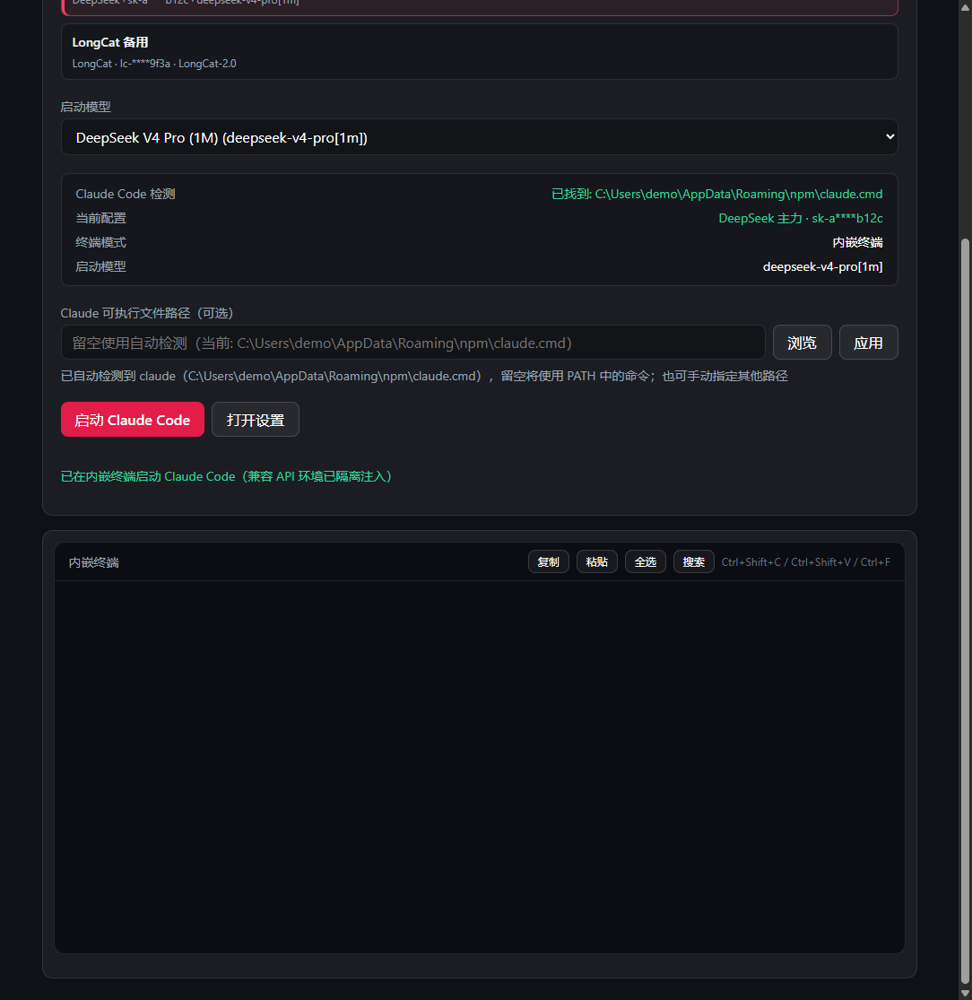
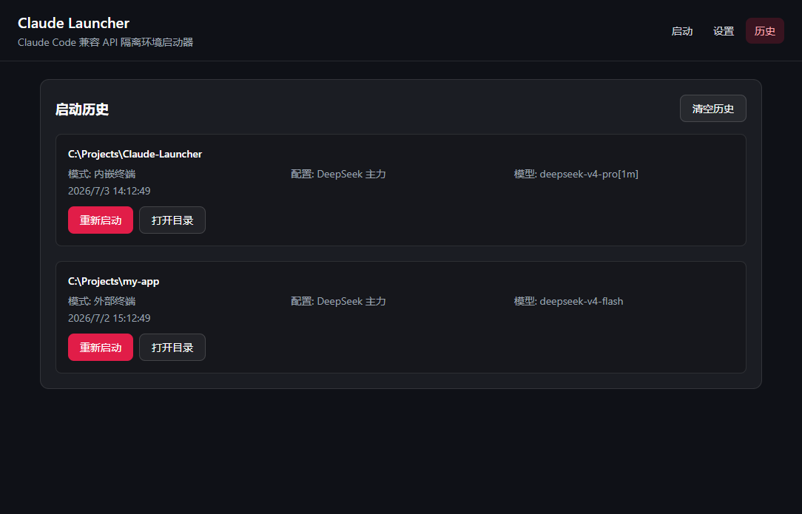

# Claude Launcher

基于 Electron 的 Claude Code 启动器，为不同 API 提供商配置独立的环境变量，支持多 Profile 管理、内置终端与一键启动。

## 功能特性

- **多 Provider 支持** — 内置 DeepSeek、LongCat、Anthropic 官方预设，也支持自定义 Base URL
- **Profile 管理** — 保存多套 API Key、模型与端点配置，随时切换
- **环境变量隔离** — 启动 Claude Code 时自动注入 `ANTHROPIC_*` / `CLAUDE_CODE_*` 变量，不影响系统全局环境
- **内置终端** — 基于 xterm.js + node-pty，在应用内直接运行 Claude Code
- **外部终端** — 可选 Windows Terminal、PowerShell 或 CMD 启动
- **模型选择** — 支持主模型、Opus / Sonnet / Haiku、Subagent 等独立配置
- **连接测试** — 保存前可测试 API 连通性并拉取可用模型列表
- **启动历史** — 记录项目路径与启动记录
- **系统托盘** — 关闭窗口时可最小化到托盘

## 环境要求

- Node.js 18+
- npm
- 已安装 [Claude Code CLI](https://docs.anthropic.com/en/docs/claude-code)

## 快速开始

```bash
# 安装依赖
npm install

# 开发模式
npm run dev

# 类型检查 + 构建
npm run build

# 预览构建产物
npm start
```

## 打包

```bash
# Windows（NSIS 安装包 + 便携版）
npm run build:win

# macOS
npm run build:mac

# Linux
npm run build:linux

# 仅输出未打包目录
npm run build:unpack
```

构建产物输出到 `release/` 目录。

## 使用说明

1. 打开应用，进入 **设置** 页面
2. 选择 Provider 或填写自定义 Base URL，填入 API Key
3. 点击 **测试连接**，确认可用后保存 Profile
4. 在 **首页** 选择项目目录与启动模型
5. 点击启动，在内置终端或外部终端中运行 Claude Code

### 环境变量

启动时 Claude Launcher 会自动设置以下变量（并清除已有的同名变量，避免冲突）：

| 变量 | 说明 |
|------|------|
| `ANTHROPIC_BASE_URL` | API 端点 |
| `ANTHROPIC_AUTH_TOKEN` | API Key |
| `ANTHROPIC_MODEL` | 主模型 |
| `ANTHROPIC_DEFAULT_OPUS_MODEL` | Opus 模型 |
| `ANTHROPIC_DEFAULT_SONNET_MODEL` | Sonnet 模型 |
| `ANTHROPIC_DEFAULT_HAIKU_MODEL` | Haiku 模型 |
| `CLAUDE_CODE_SUBAGENT_MODEL` | Subagent 模型 |
| `CLAUDE_CODE_EFFORT_LEVEL` | 推理强度 |

还可在设置中添加自定义环境变量键值对。

## 开发

```bash
# 类型检查
npm run typecheck

# 代码检查
npm run lint

# 格式化
npm run format

# 验证环境变量构建逻辑
npm run verify:env

# 重新生成 README 截图（需先 build）
npm run build
npx electron scripts/capture-screenshots.cjs
```

## 技术栈

- [Electron](https://www.electronjs.org/) + [React](https://react.dev/) + [TypeScript](https://www.typescriptlang.org/)
- [electron-vite](https://electron-vite.org/) — 构建工具
- [xterm.js](https://xtermjs.org/) + [node-pty](https://github.com/microsoft/node-pty) — 内置终端
- [electron-store](https://github.com/sindresorhus/electron-store) — 本地配置持久化

## 项目结构

```
src/
├── main/           # Electron 主进程（终端、IPC、配置存储）
├── preload/        # 预加载脚本（渲染进程 API 桥接）
├── renderer/       # React 前端界面
└── shared/         # 主进程与渲染进程共享类型与常量
```

## 界面预览

### 启动页

选择项目目录、切换 Profile 与模型，一键启动 Claude Code。



### 设置页

管理多套 API 配置，支持 Provider 预设、连接测试与模型映射。



### 内置终端

在应用内直接运行 Claude Code，环境变量仅注入子进程。



### 启动历史

记录每次启动的项目路径、终端模式与模型，支持快速重新启动。



## License

Private — 仅供个人使用。
